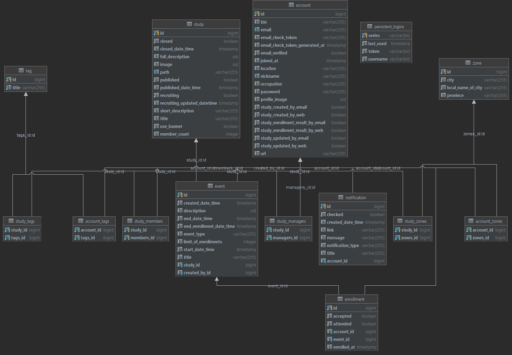

## StudyShip

마음이 맞는 스터디원 모집과 모임 약속을 잡기 위한 스터디 및 모임 관리 서비스

## 🛠 Tech Stack

- Spring
- Spring Data JPA
- PostgreSQL
- Thymeleaf
- JUnit5
- Spring Security

## 📘 DB

## 📜정의
회원가입
- 회원 가입 폼 검증
    - JSR 303 애노테이션 검증(값의 길이, 필수 값)
- 커스텀 검증
    - 중복 이메일, 닉네임 여부 확인
- Spring Security 적용
- 메일 인증
    - 재전송
    
로그인, 로그아웃
- Spring Security Form Login 사용

로그인 저장(RememberMe)
- 안전한 영속화 기반 설정(Spring Security 기반)
    - Username, 토큰(랜덤, 매번 바뀜), 시리즈(랜덤, 고정)
    - 쿠키를 탈취 당한 경우, 희생자는 유효하지 않은 토큰과 유효한 시리즈와 Username으로 접속
    - 이경우 모든 토큰을 삭제하여 탈취한 쿠키를 사용하지 못하도록 방지

계정 설정
- 프로필 수정
- 패스워드 수정
- 알림 설정
- 닉네임 수정
- 패스워드 찾기

관심주제 및 지역정보
- 관심주제 등록
- 관심주제 조회
- 관심주제 삭제
- 관심 주제 자동완성(whitelist)
- 지역 정보 추가 및 삭제

DB 와 이메일
- PostgreSQL 사용
- 테스트 DB 분리 - TestContainers
- SMTP 설정(gmail)
- EmailService 추상화
  - ConsoleEmailService: 콘솔출력
  - HtmlEmailService: 실제 Html 이메일 전송

스터디
- 스터디 개설
- 스터디 조회
- 스터디 설정(배너, 태그/지역, 상태 변경 등)
- 스터디 삭제
- 스터디 참여 및 탈퇴

모임
- 모임 생성
- 모임 조회
- 모임 수정
- 모임 참가 신청 및 취소, 출석 체크

알림
- 알림 추가(스터디 개설, 스터디 변경, 모임 관련 등)
- 알림 목록 조회 및 삭제

검색 및 페이징

테스트

리팩토링